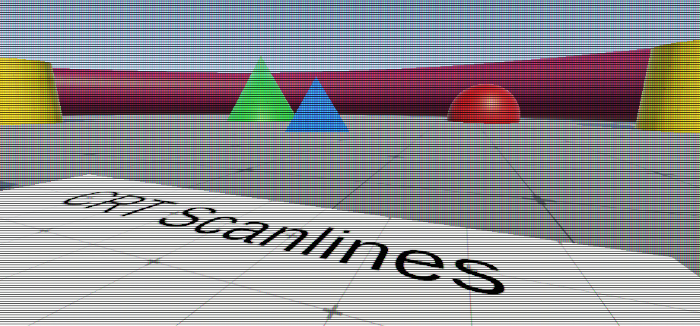
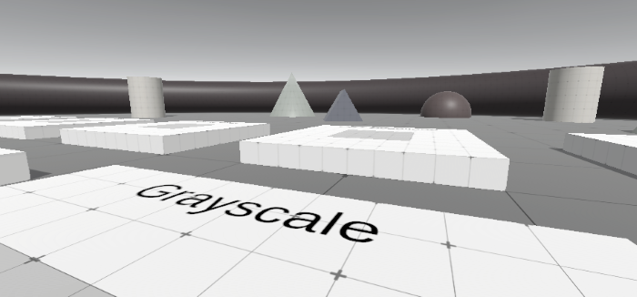

# Nexcide Post Processing
A custom post processing solution implemented using single ScriptableRendererFeature and ScriptableRenderPass
implementations. Each post processing effect support volumes. A pass is created for each enabled VolumeComponent.

Each class containing a VolumeComponent also contains a VolumeEffect implementation. So all properties for post
processing shader are in the same place. Also supports multi-pass shaders, the Gaussian Blur effect is an example of
this.

All shaders are implemented using Shader Graph, except the Gaussian blur effect. 17 post processing effects are included

### 01. Checkerboard
Displays a checkerboard pattern where black squares become opaque and white square are unchanged. I don't recall
why I made this... I think it's from when I was just learning about Shader Graph.

### 02. Color Bleed
Samples multiple times at different offsets for chromatic aberration with random jumps over time. Uses a custom function.

### 03. Color Filter
Very simple shader that multiplies the input texture by a color. Same effect as the 'Color Filter' option in the default
URP Color Adjustments effect.

### 04. CRT Scanlines
Overlays scanlines to simluate a CRT display.

### 05. Depth
Shows the scene depth.

### 06. Fade To Color
Blends entire texture so when fully applied the whole screen will be the given color. This was created so I could fade
to white (using default URP post processing), followed by fading to black.

### 07. Fullscreen Outlines
Entirely in Shader Graph. Uses color & normal deltas for edge detection.

### 08. Gaussian Blur
A 2 pass Gaussian Blur created using HLSL instead of Shader Graph. Has Spread & Grid Size parameters.

### 09. Grayscale
Simply applies grayscale with optional exposure parameter.

### 10. Monochrome
Not grayscale, but actually just 1 color (and black). Default color is white.

### 11. Pixelate
Pixelates the input texture using the Posterize node. Has Pixel Size and Tint parameters.

### 12. Pixelate Depth
An attempt at pixelating based on depth, so objects further away would be chunkier. Uh... this doesn't work very well,
I might revisit it at a later date...

### 13. Rectangle
Bit of a weird one. This was created for reference, for handling an Aspect Ratio parameter.

### 14. RGB Lines
Similar to CRT Scanlines, but better looking, with random chromatic aberration splitting over time and more parameters.

### 15. Sepia
Applies the sepia tone, with optional Exposure parameter.

### 16. Sobel
A Sobel filter. Uses a custom function.

### 17. Static Noise
Noise with optional horizontal scanlines. Lots of parameters including speed & frequency of noise and lines.

